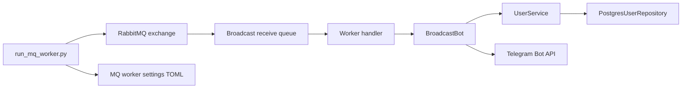

# Telegram user app service

## How to run RabbitMQ in docker

- docker run --name my-rabbit -p 5672:5672 rabbitmq:4.2.4-management

## How to run Infisical in docker

- docker pull infisical/infisical:v0.159.8

## How to run local compose for dev

- docker compose -f docker-compose.dev.yml up -d

## Architecture and workflow

### Overview
The Telegram User App Service supports:
- Telegram user registration and subscription management
- broadcast delivery through HTTP, Telegram polling, and RabbitMQ
- PostgreSQL-backed user persistence
- Infisical-based secret retrieval for bot tokens and database credentials

### FastAPI workflow
- `src/scripts/run_fastapi.py` loads settings and starts the FastAPI server.
- `src/fastapi/app.py` creates the FastAPI application and mounts `/api/user` and `/api/bot`.
- `src/fastapi/user_service.py` implements user CRUD endpoints using `UserService`.
- `src/fastapi/telegram_bot.py` implements the broadcast endpoint using `BroadcastBot`.
- `src/db/__init__.py` creates `UserService` instances backed by `PostgresUserRepository`.
- `src/db/postgres_user_repository.py` persists and queries user records in PostgreSQL.

```mermaid
flowchart LR
    A[run_fastapi.py] --> B[FastAPI app]
    B --> C[/health]
    B --> D[/api/user/*]
    B --> E[/api/bot/broadcast]
    D --> G[UserService]
    E --> F[BroadcastBot]
    F --> G
    G --> H[PostgresUserRepository]
    H --> I[Postgres DB]
    J[settings TOML + Infisical secrets] --> B
    J --> F
    J --> G
```

### Telegram bot workflow
- `src/fastapi/app.py` starts `src.telegram.app.start_telegram_application()` in a background thread on FastAPI startup.
- `src/telegram/app/telegram_application.py` registers `/subscribe` and `/unsubscribe` handlers.
- Handlers use `user_service_context()` to query or update the same `UserService`.
- Subscription updates persist to the `users` table in PostgreSQL.

```mermaid
flowchart LR
    A[FastAPI startup] --> B[Telegram poller thread]
    B --> C[/subscribe handler]
    B --> D[/unsubscribe handler]
    C --> E[UserService]
    D --> E
    E --> F[PostgresUserRepository]
    F --> G[Postgres DB]
    B --> H[Infisical secrets -> TELEGRAM_ACCESS_TOKEN]
```

### RabbitMQ broadcast workflow
- `src/scripts/run_mq_worker.py` loads MQ settings and listens for broadcast messages.
- Incoming messages are converted to `BroadcastRequest` objects.
- `src/telegram.bot.broadcast_bot_context` creates `BroadcastBot` with `UserService`.
- `BroadcastBot.broadcast()` queries subscribed users and sends messages through the Telegram Bot API.



### Configuration
- `src/settings/settings.toml` stores service, Infisical, and database configuration.
- `src/settings/fastapi_settings.toml` configures FastAPI host and port.
- `src/settings/mq_worker_settings.toml` configures RabbitMQ connectivity and queues.
- `src/.db.env` and `src/.infisical.env` hold local development secrets.

This service organizes user management, Telegram polling, and broadcast delivery through a shared database and secret-management foundation.
