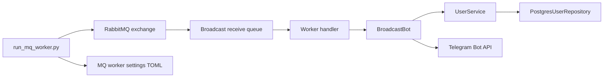

# Telegram user app service

## How to run RabbitMQ in docker

- docker run --name my-rabbit -p 5672:5672 rabbitmq:4.2.4-management

## How to run Infisical in docker

- docker pull infisical/infisical:v0.159.8

## How to run local compose for dev

- docker compose -f docker-compose.dev.yml up -d

## Architecture and workflow

### Overview
The Telegram User App Service handles Telegram user registration, subscription management, and message broadcasting.
It consists of:
- a FastAPI HTTP API for user management and broadcasts
- a Telegram bot poller for `/subscribe` and `/unsubscribe` commands
- a RabbitMQ worker for queued broadcast delivery
- database persistence for user records
- Infisical secrets management for the bot token and DB password

### FastAPI workflow
- `src/scripts/run_fastapi.py` loads settings and starts the FastAPI app.
- `src/fastapi/app.py` exposes `/health`, `/api/user`, and `/api/bot` routes.
- `src/fastapi/user_service.py` manages user CRUD operations using `UserService`.
- `src/fastapi/telegram_bot.py` sends broadcast messages via `BroadcastBot`.
- `src/db/__init__.py` creates `UserService` instances from `PostgresUserRepository`.
- `src/db/postgres_user_repository.py` persists data to PostgreSQL.

```mermaid
flowchart LR
    A[run_fastapi.py] --> B[FastAPI app]
    B --> C[/health]
    B --> D[/api/user/*]
    B --> E[/api/bot/broadcast]
    E --> F[BroadcastBot]
    D --> G[UserService]
    F --> G
    G --> H[PostgresUserRepository]
    H --> I[Postgres DB]
    A --> J[settings TOML + Infisical secrets]
    J --> B
```

### Telegram bot workflow
- On startup, `src/fastapi/app.py` launches `src.telegram.app.start_telegram_application` in a background thread.
- The Telegram bot handles `/subscribe` and `/unsubscribe` commands.
- Both commands use `user_service_context()` to access the same `UserService` and database repository.
- Subscription state is stored in the `users` table.

```mermaid
flowchart LR
    A[FastAPI startup] --> B[Telegram poller thread]
    B --> C[/subscribe handler]
    B --> D[/unsubscribe handler]
    C --> E[UserService]
    D --> E
    E --> F[PostgresUserRepository]
    F --> G[Postgres DB]
    B --> H[Infisical secrets -> TELEGRAM_ACCESS_TOKEN]
```

### RabbitMQ broadcast workflow
- `src/scripts/run_mq_worker.py` consumes `BroadcastRequest` messages from RabbitMQ.
- `src/telegram.bot.broadcast_bot_context` creates a `BroadcastBot` instance.
- `BroadcastBot.broadcast()` queries subscribed users and sends Telegram messages.



### Configuration
- `src/settings/settings.toml` stores service, Infisical, and database configuration.
- `src/settings/fastapi_settings.toml` configures the FastAPI host and port.
- `src/settings/mq_worker_settings.toml` configures RabbitMQ connectivity and queues.
- `src/.db.env` and `src/.infisical.env` hold local development secrets.

This design gives a consistent user management and broadcast pipeline across HTTP, Telegram polling, and message queue delivery.
